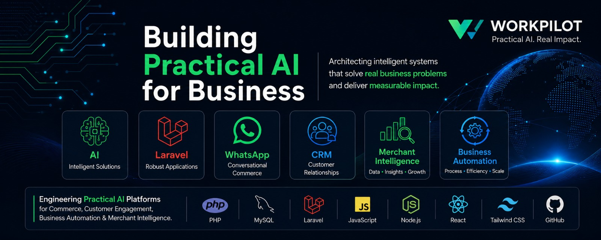

# Hi, I'm Abayomi Olusesan Karim👋

## Founder of Workpilot

Software Architect • Laravel Developer • AI Engineer

Building practical AI products for commerce, CRM,
automation and merchant intelligence.

---

## What I Believe

Technology should solve real business problems.

I build software that helps businesses automate work, improve customer engagement, and grow sustainably through practical artificial intelligence.

---

## Current Ecosystem

### Workpilot

Building practical AI-powered software products for businesses.

### Chioma

AI-powered business copilot for customer engagement and business automation.

### MerchantPilot

International customer engagement and commerce platform powered by practical AI.

---

## Areas of Interest

- Practical Artificial Intelligence
- Business Automation
- SaaS Products
- Customer Engagement
- CRM Systems
- Commerce Technology
- API Integrations
- Product Strategy

---

## Building

Current focus:

- Chioma
- MerchantPilot
- Future AI Agents
- Business Automation Tools
- Open Source Resources

---

## Philosophy

Practical AI.

Practical software.

Practical business value.

---

## Connect

Always interested in collaborating on practical AI and business software projects.
